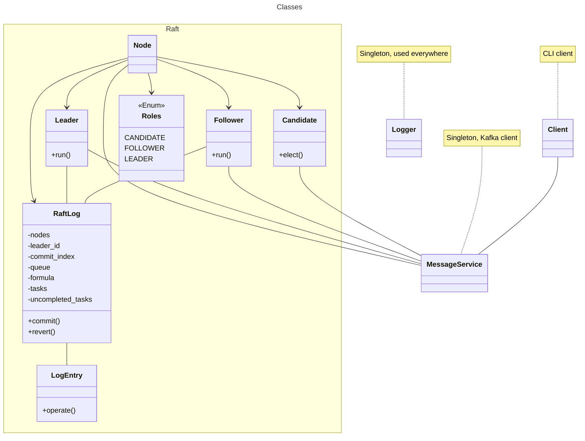
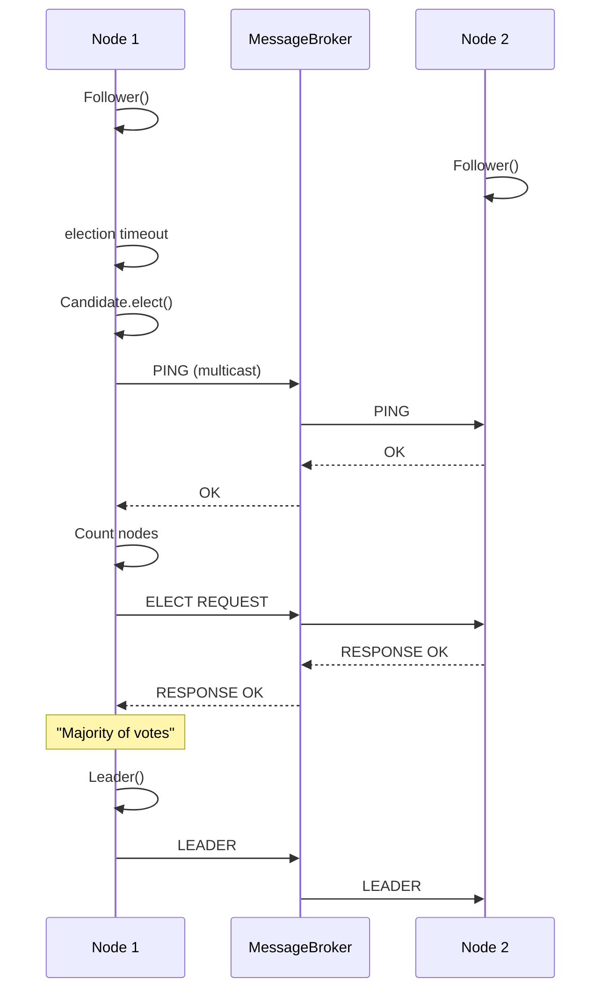

# Architecture

```mermaid
---
title: Classes
---
classDiagram

namespace Raft {
    class Node

    class Candidate {
        +elect()
    }

    class Leader {
        +run()
    }

    class Follower {
        +run()
    }

    class Roles {
        CANDIDATE
        FOLLOWER
        LEADER
    }
    class RaftLog {
        -nodes
        -leader_id
        -commit_index
        -queue
        -formula
        -tasks
        -uncompleted_tasks

        +commit()
        +revert()
    }
    class LogEntry {
        +operate()
    }
}

class MessageService
class Logger
class Client

note for Logger "Singleton, used everywhere"
note for MessageService "Singleton, Kafka client"
note for Client "CLI client"

<<Enum>> Roles
Node --> Roles
Node --> Candidate
Node --> Leader
Node --> Follower
Node --> RaftLog
Node -- MessageService

Leader -- MessageService
Follower -- MessageService
Candidate -- MessageService
Leader -- RaftLog
Follower -- RaftLog

RaftLog -- LogEntry

Client -- MessageService
```

## Initialization

```mermaid
sequenceDiagram
    participant Node1 as Node 1
    participant MessageBroker
    participant Node2 as Node 2

    Node1 ->> Node1: Follower()
    Node2 ->> Node2: Follower()

    Node1 ->> Node1: election timeout
    Node1 ->> Node1: Candidate.elect()

    Node1 ->> MessageBroker: PING (multicast)
    MessageBroker ->> Node2: PING
    Node2 -->> MessageBroker: OK
    MessageBroker -->> Node1: OK

    Node1 ->> Node1: Count nodes

    Node1 ->> MessageBroker: ELECT REQUEST
    MessageBroker ->> Node2:

    Node2 -->> MessageBroker: RESPONSE OK
    MessageBroker -->> Node1: RESPONSE OK

    Note over Node1: "Majority of votes"
    Node1 ->> Node1: Leader()
    Node1 ->> MessageBroker: LEADER
    MessageBroker ->> Node2: LEADER
```
