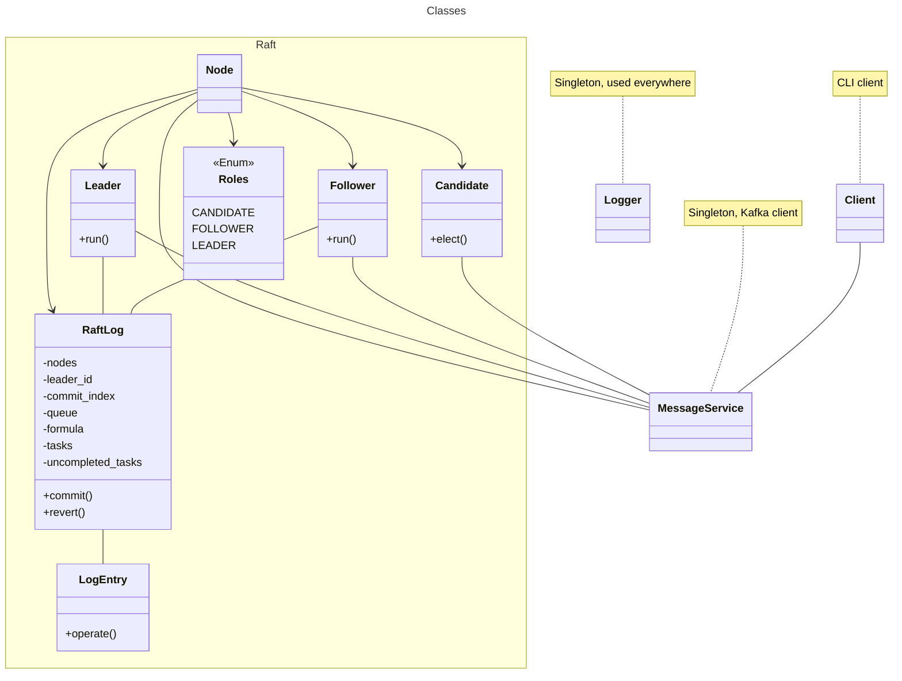

# Architecture

```mermaid
---
title: Classes
---
classDiagram

namespace Raft {
    class Node

    class Candidate {
        +elect()
    }

    class Leader {
        +run()
    }

    class Follower {
        +run()
    }

    class Roles {
        CANDIDATE
        FOLLOWER
        LEADER
    }
    class RaftLog {
        -nodes
        -leader_id
        -commit_index
        -queue
        -formula
        -tasks
        -uncompleted_tasks

        +commit()
        +revert()
    }
    class LogEntry {
        +operate()
    }
}

class MessageService
class Logger
class Client

note for Logger "Singleton, used everywhere"
note for MessageService "Singleton, Kafka client"
note for Client "CLI client"

<<Enum>> Roles
Node --> Roles
Node --> Candidate
Node --> Leader
Node --> Follower
Node --> RaftLog
Node -- MessageService

Leader -- MessageService
Follower -- MessageService
Candidate -- MessageService
Leader -- RaftLog
Follower -- RaftLog

RaftLog -- LogEntry

Client -- MessageService
```
