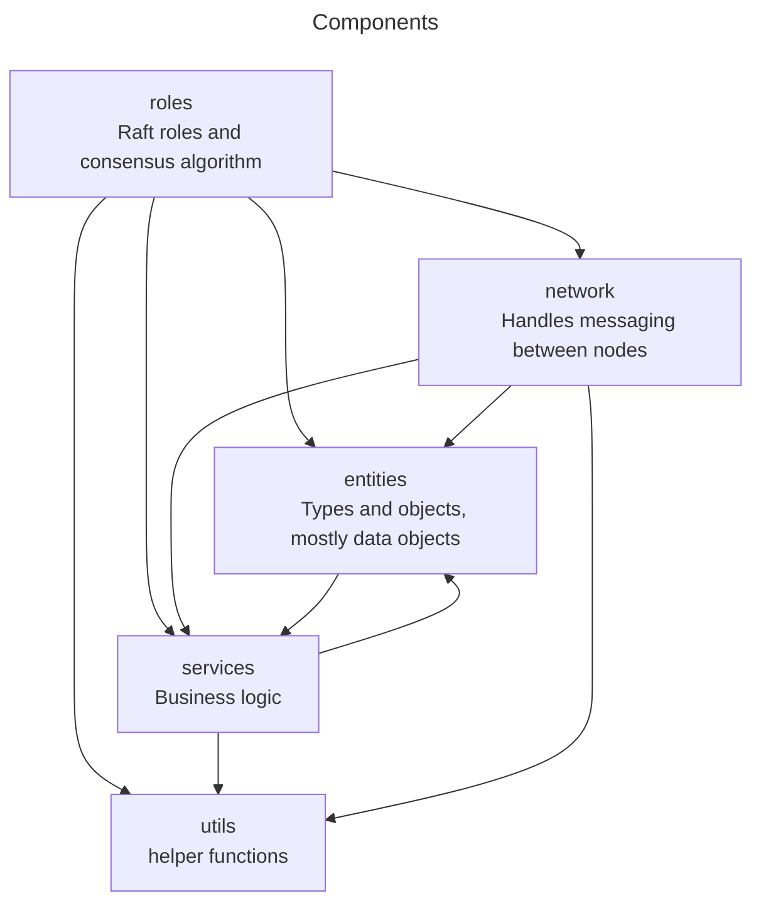
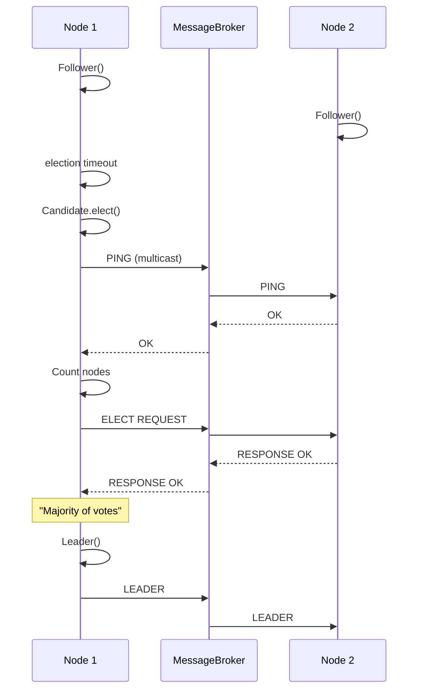

# Architecture

```mermaid
---
title: Components
---
graph

roles[
    roles
    Raft roles and consensus algorithm
]
network[
    network
    Handles messaging between nodes
]
services[
    services
    Business logic
]
entities[
    entities
    Types and objects, mostly data objects
]
utils[
    utils
    helper functions
]


roles --> network
roles --> services
roles --> utils
roles --> entities

services --> utils
services --> entities

network --> entities
network --> services
network --> utils

entities --> services
```

The usage of other directories:

- `benchmark`: Performance testing
- `examples`: Prototyping

## Initialization

```mermaid
sequenceDiagram
    participant Node1 as Node 1
    participant MessageBroker
    participant Node2 as Node 2

    Node1 ->> Node1: Follower()
    Node2 ->> Node2: Follower()

    Node1 ->> Node1: election timeout
    Node1 ->> Node1: Candidate.elect()

    Node1 ->> MessageBroker: PING (multicast)
    MessageBroker ->> Node2: PING
    Node2 -->> MessageBroker: OK
    MessageBroker -->> Node1: OK

    Node1 ->> Node1: Count nodes

    Node1 ->> MessageBroker: ELECT REQUEST
    MessageBroker ->> Node2:

    Node2 -->> MessageBroker: RESPONSE OK
    MessageBroker -->> Node1: RESPONSE OK

    Note over Node1: "Majority of votes"
    Node1 ->> Node1: Leader()
    Node1 ->> MessageBroker: LEADER
    MessageBroker ->> Node2: LEADER
```
